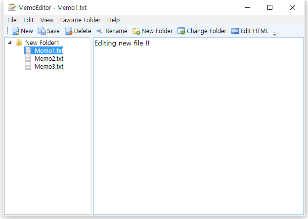
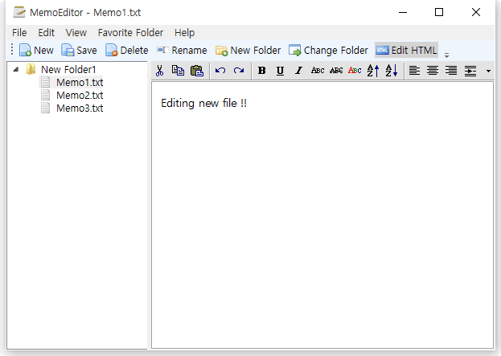

# MemoEditor
WPF based text editor with treeview navigation. Using [MVVMLight](https://github.com/lbugnion/mvvmlight)

- A MemoEditor; 
left file explorer is based on "[TreeView In-place Editing in MVVM](https://treeviewinplaceedit.codeplex.com)"  article

- This project consists of Treeview and simple TextEdit component. The treeview represents 
the folders and textedit represents their text files(.txt). These result in simple MS Windows Explorer style memo editor.
Easily create *.txt(.html) memo and it is automatically saved when tree focus moves to another node, or program exits, or also by clicking save button. 
The saved file is saved on a .txt file, not on a database.

- Screenshot

</img> 

</img> 
